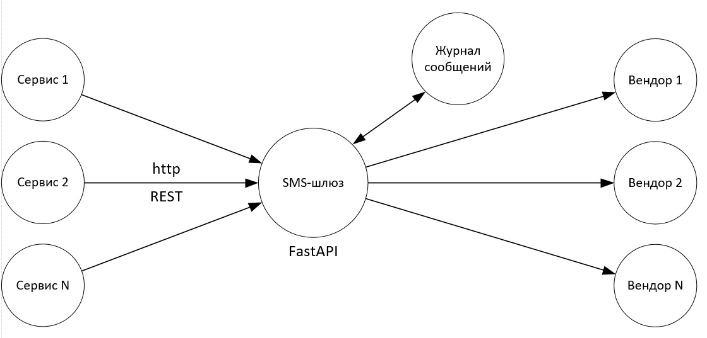
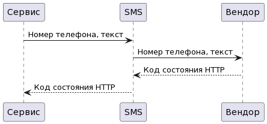

# SMS-Gateway

### Summary:

This is SMS-gateway to send messages to users by phone number.

**[FastAPI](https://fastapi.tiangolo.com/)** API web framework
**[Celery](http://www.celeryproject.org/)** for background and delayed tasks  
**[Redis](https://redis.io/)** for the message broker  
**[Docker](https://docs.docker.com/)** for containerization  
**[Docker Compose](https://docs.docker.com/compose/)** for defining and running multi-container  



---

### Endpoints Table:

| Request URL      | Description                                                            |  HTTP  |
| ---------------- | ---------------------------------------------------------------------- | ------ |
| /sending         | User sends a request to send a message to one recipient.               | `POST` |
| /mailing         | User sends a request to send a message to multiple recipients.         | `POST` |

---

### Requirements:
* Docker and Docker Compose

### How to Run:

```
docker-compose up --build
```

### Example Requests:

---

#### Request:
```http request
POST /sending
```

#### Response:
```json
{
  "task_id": "6e2bcbdf-823b-43ad-b099-30e40d8a7f00",
  "task_status": "SUCCESS",
  "task_result": {
    "status": 200,
    "number": 88005553535,
    "URL": "https://www.google.com/?q=Hello&q=88005553535"
  }
}
```

---

#### Request:
```http request
POST /mailing
```

#### Response:
```json
{
  "task_id": "3d0a1c87-de5a-45f7-a4e5-10f425f79a2c",
  "task_status": "SUCCESS",
  "task_result": [
    {
      "status": 200,
      "number": 88005553535,
      "URL": "https://www.google.com/?q=Welcome%21&q=88005553535"
    },
    {
      "status": 200,
      "number": 85539317914264,
      "URL": "https://www.google.com/?q=85539317914264&q=Welcome%21"
    },
    {
      "status": 200,
      "number": 88865032571223,
      "URL": "https://www.google.com/?q=Welcome%21&q=88865032571223"
    },
    {
      "status": 200,
      "number": 82377989412173,
      "URL": "https://www.google.com/?q=Welcome%21&q=82377989412173"
    },
    {
      "status": 200,
      "number": 86727648373299,
      "URL": "https://www.google.com/?q=Welcome%21&q=86727648373299"
    }
  ]
}
```

---

### Phone numbers for example:

```
88005553535,
85539317914,
88865032571,
82377989412,
86727648373,
82867815368,
87818671224,
82031433549,
84793239876,
88462090826,
87489908861,
89964389229,
85506385459,
81983889204,
84895267370,
89473222295,
86074441159,
87631860979,
81346050094,
89203328147,
82908610700
```

---

**Alexey Mamykin**
